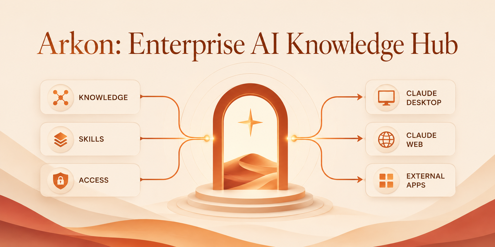
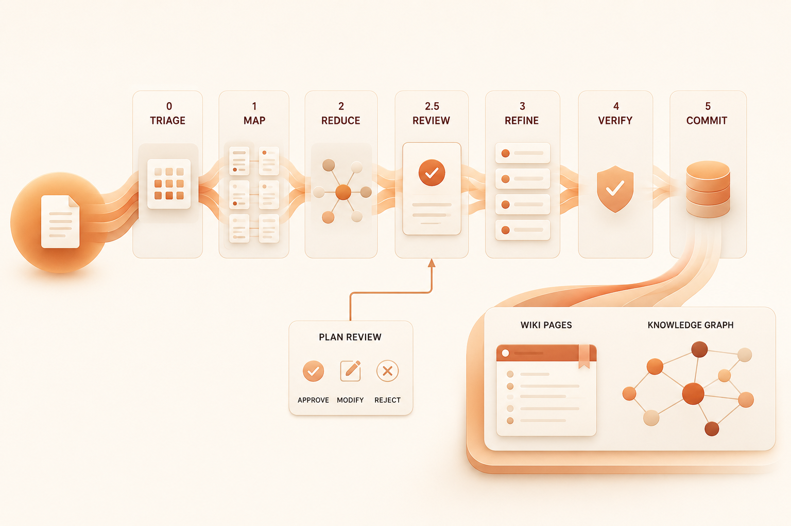
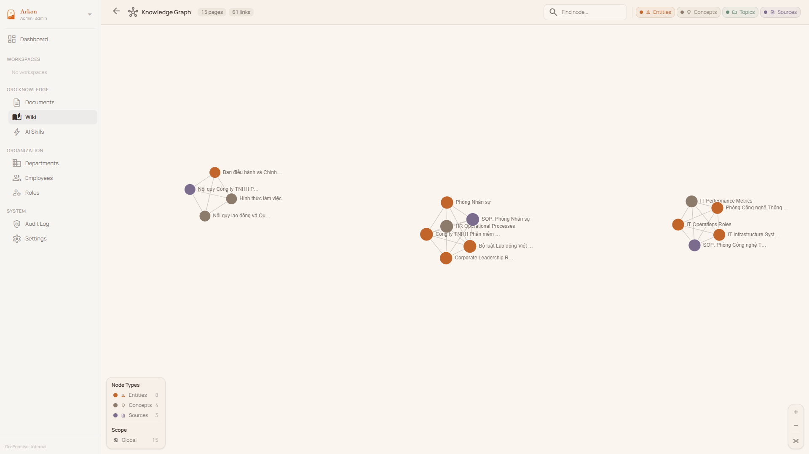
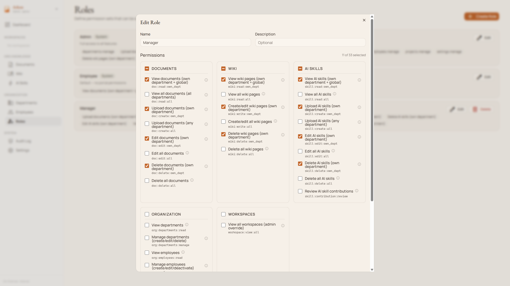
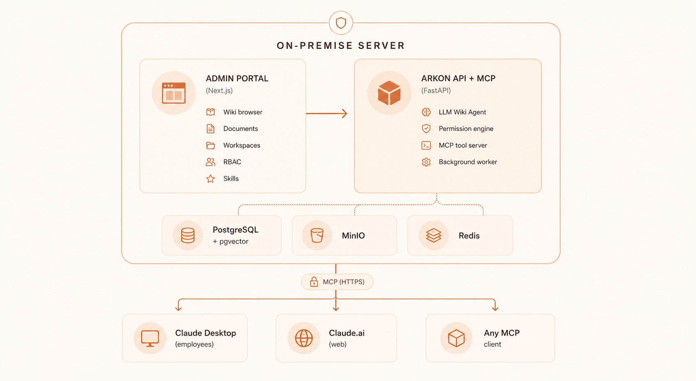
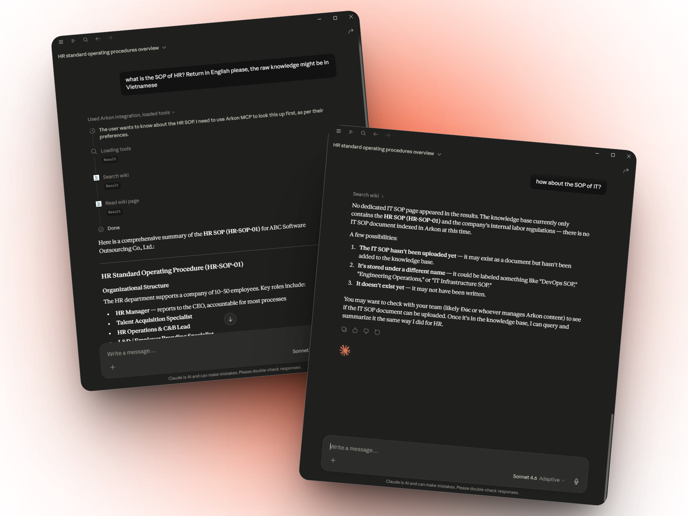

# Arkon - The Open-Source Enterprise AI Knowledge Hub & MCP Server

<p align="center">
  <a href="LICENSE"></a>
  <a href="https://github.com/nduckmink/arkon/stargazers"></a>
  <a href="https://www.docker.com/"></a>
</p>

<p align="center">
  
</p>

**Arkon** is a self-hosted, enterprise-grade knowledge management layer that bridges organizational data and AI clients. It runs as a centralized **MCP Server** (Model Context Protocol), compiling your SOPs, policies, and internal docs into a structured, traceable knowledge wiki - then serving that wiki to Claude and other LLMs through a single permission-scoped endpoint.

## 🚀 Why Arkon?

In most organizations, AI adoption is fragmented. Employees copy-paste documents into chatbots, producing inconsistent context, security risks, and duplicated work.

**Arkon treats AI as a managed organizational resource.** Every employee gets the right context, automatically and securely - filtered by their department, project membership, and role.

<p align="center">
  
</p>

---

## ✨ Key Features

### 🧠 Intelligent Knowledge Wiki - the MRP Pipeline
Unlike a vector database that just chunks and indexes, Arkon's **MRP pipeline** (**M**ap → **R**educe → **P**lan-review → **R**efine → **V**erify → Commit) actually compiles documents into a coherent wiki of interlinked pages.
- **Plan review before write:** every ingestion produces a human-reviewable plan listing which wiki pages will be created or updated. Editors can regenerate the plan with feedback before any page is written.
- **Page merge instead of overwrite:** when a new source touches an existing wiki page, content is LLM-merged so prior knowledge is never lost.
- **Traceable claims:** every page records the source documents it was compiled from.
- **Image-aware:** vision captions are baked into source text before compilation, so wiki pages reference the right images in the right places.
- **Resumable:** drafts persist mid-pipeline; a crashed run resumes without re-doing the expensive LLM work.

### 📚 Wiki Browser & Knowledge Graph
- Three-panel layout: page tree, content, backlinks & outlinks.
- Full-text + semantic (pgvector) search.
- Interactive knowledge graph visualization (per-scope or global).
- Wikilink-style cross-references between pages.
- Version history and rollback on every page.
- Draft proposal → editor review → approval workflow.

<p align="center">
  
</p>

### 🏢 Workspaces (Department & Project Scopes)
Cross-functional contexts with their own scoped wiki, document set, and member roster.
- **Department-level isolation** for HR, Legal, Engineering, etc.
- **Project workspaces** for cross-functional initiatives or clients.
- **Hard scope enforcement:** members only see knowledge from their assigned scopes - at the API, MCP, and search layers.

### 🛂 Fine-Grained RBAC
Role-based access control at department + workspace level.
- Built-in roles: **Viewer · Contributor · Editor · Admin** (and admin-defined custom roles).
- Granular permissions (`doc:read:own_dept`, `wiki:edit:all`, `org:settings:manage`, ...).
- **Audit log** for every privileged action - settings changes, plan approvals, role updates.

<p align="center">
  
</p>

### 🔌 MCP Server for Claude & Other AI Clients
Employees connect Claude Desktop or Claude.ai to Arkon via **OAuth 2.1 + PKCE** — just add the server URL and sign in through the browser. No manual token copying required. The MCP server exposes:
- **Wiki tools** - `search_wiki`, `read_wiki_page`, `list_wiki_pages`, `read_wiki_index`.
- **Source drill-down** - `get_source`, `get_source_outline`, `get_source_pages`, `list_sources`.
- **Edit workflow** - `propose_wiki_edit`, `edit_wiki_page`, `list_pending_drafts`, `review_draft`, `approve_draft`, `reject_draft`.
- **Discovery** - `list_knowledge_types`, `get_knowledge_type_docs`.

All tools enforce per-token scope (department, knowledge type, source list).

### 🧰 AI Skills Distribution
Upload custom agent packages once and distribute them across the org.
- Versioned skill packages (.zip with `SKILL.md`).
- Department-scoped visibility.
- Contribution workflow for end-user updates.

### 🤖 Pluggable AI Providers
Catalog-driven selection - admins pick from a curated list with context window, cost, and capability metadata on display.
- **LLM:** Anthropic Claude (Opus / Sonnet / Haiku 4.x), Google Gemini (3.x Pro / Flash / Flash-Lite, 2.5), OpenAI (GPT-5.x, GPT-4.x).
- **Embedding:** Google `gemini-embedding-*`, OpenAI `text-embedding-3-*` - switchable with online re-embed migration (active model atomically flipped on completion, no zero-result search window).
- **Vision:** Google Gemini Flash, OpenAI GPT-4o family.

### 🔒 Privacy & Security First
- **Self-hosted.** Deploy on-prem or in your private cloud via Docker.
- **No telemetry.** Outbound traffic goes only to the AI provider you choose.
- **Encrypted at rest.** API keys stored with Fernet encryption in PostgreSQL.

---

## 🛠️ Tech Stack

<p align="center">
  
</p>

- **Backend:** FastAPI · PostgreSQL + pgvector · Redis (arq workers) · MinIO
- **Frontend:** Next.js · Tailwind CSS
- **AI integration:** Model Context Protocol via FastMCP
- **Document parsing:** PDF, DOCX, DOC, plain text, URLs, embedded images

---

## 💻 Server Requirements

Arkon runs **7 Docker containers** (PostgreSQL + pgvector, Redis, MinIO, FastAPI API, 2 ARQ workers, Next.js frontend). The table below provides recommended configurations based on team size:

| | **Starter** | **Team** | **Enterprise** |
|---|:---:|:---:|:---:|
| **Team size** | 1 – 20 | 20 – 100 | 100+ |
| **vCPU** | 2 cores | 4 cores | 8+ cores |
| **RAM** | 4 GB | 8 GB | 16+ GB |
| **Storage** | 40 GB SSD | 100 GB SSD | 250+ GB NVMe SSD |
| **OS** | Ubuntu 22.04+ / Debian 12+ | Ubuntu 22.04+ / Debian 12+ | Ubuntu 22.04+ / Debian 12+ |
| **Use case** | Evaluation / small teams | Departmental deployment | Organization-wide rollout |

> [!NOTE]
> - **RAM** is the primary bottleneck — the MRP pipeline workers load large LLM context windows into memory during wiki compilation.
> - **Storage** scales with your document corpus — pgvector indexes, MinIO file storage, and PostgreSQL WAL logs are the main consumers.
> - All AI inference happens externally (Anthropic / Google / OpenAI APIs), so **GPU is not required**.
> - A reverse proxy (Nginx / Caddy) with SSL is recommended for production. See [Setup Guide](docs/SETUP.md).

---

## 🚦 Quick Start (Docker)

> [!NOTE]
> **Arkon is built for teams, not individuals.** If you're looking for a personal knowledge setup, [Obsidian](https://obsidian.md) + Claude Skills is a much simpler fit.
>
> **Not a tech person?** Skip the self-hosting hassle — reach out for a **free guided demo** tailored for your team. No config, no Docker, just a walkthrough of what Arkon can do for your organization.

**Prerequisites:** Docker & Docker Compose, plus an API key from your preferred AI provider (Anthropic, Google, or OpenAI).

1. **Clone the repository:**
   ```shell
   git clone https://github.com/nduckmink/arkon.git
   cd arkon
   ```

2. **Configure environment:**
   ```shell
   cp .env.docker.example .env.docker
   # Edit .env.docker - set SECRET_KEY, admin credentials, and Postgres/MinIO secrets
   ```

3. **Launch:**
   ```shell
   docker compose --env-file .env.docker up -d --build
   ```

4. Access the portal at `http://localhost:3119`, sign in as admin, then go to **Settings** to pick your embedding / LLM / vision models and paste API keys.

→ See [Setup Guide](docs/SETUP.md) for development mode and the full env reference.

---

## 🔗 Connecting Claude

In **Claude Desktop** or **Claude.ai → Settings → Connectors**, add a custom connector:

- **Name:** `Arkon`
- **URL:** `https://your-arkon-server/mcp`

Click **Connect** → a browser window opens with the Arkon login form → sign in with your Arkon credentials → done. Arkon uses OAuth 2.1 + PKCE so no manual token setup is required.

**To make Claude consistently use Arkon**, add this to Claude's **Custom Instructions** (Settings → Custom Instructions):

```
Whenever answering questions related to the company — its processes, products,
people, departments, policies, or projects — always search Arkon first using
the search_wiki tool before relying on general knowledge.
```

For stronger enforcement, create a **Project** in Claude Desktop, attach Arkon as a connector, and paste the same text as Project Instructions.

<p align="center">
  
</p>

→ See [MCP & Claude](docs/MCP.md) for the complete tool reference.

---

## 🗺️ Roadmap

- [x] **MRP Pipeline** - deterministic compilation with plan review, page merge, and resume-on-crash.
- [x] **MCP Server** - scoped wiki + source + draft tools.
- [x] **Workspaces** - department isolation + project scopes with RBAC.
- [x] **Wiki draft & revision workflow** - propose, review, approve, rollback.
- [x] **AI Skills** - versioned, department-scoped agent packages.
- [x] **Catalog-driven model selection** - LLM, embedding, and vision picked from a curated list with cost/context-window metadata.
- [x] **Online embedding migration** - atomic re-embed with no search downtime.
- [x] **Audit log** - privileged actions tracked.
- [ ] **Rich media ingestion** - bulk folder upload with images, videos, and Excel/spreadsheet parsing baked into the MRP pipeline.
- [ ] **External data import** - connectors for SharePoint, Google Drive, Notion, and other common org data sources.
- [ ] **Arkon CLI** - one-command setup for employees.
- [ ] **Notification system** - for draft reviews and plan approvals.
- [ ] **Usage analytics dashboard** - cost + adoption per department.

---

## ⭐ Star History

[](https://star-history.com/#nduckmink/arkon&Date)

---

## 📄 License

Arkon is licensed under the [PolyForm Internal Use License 1.0.0](LICENSE). Free for internal business operations; you may not offer Arkon as a service to third parties.

For enterprise support or custom integrations, please contact the maintainers.

---

**Keywords:** *Enterprise AI, Model Context Protocol, MCP Server, Knowledge Management System, Self-hosted RAG, AI Knowledge Base, Claude MCP, LLM Context Management, Open Source Wiki.*

---

## 📬 Contact

**Main Author**
Minh Nguyen (Nguyễn Đức Minh) — Vietnam (GMT+7) · Fluent English
✉️ [duckmink.bitsness@gmail.com](mailto:duckmink.bitsness@gmail.com)

**Company**
BITSNESS TECHNOLOGY AND SOLUTIONS COMPANY LIMITED
✉️ [bitsness.ad@bitsness.vn](mailto:bitsness.ad@bitsness.vn)

For enterprise inquiries, demo requests, or custom integrations — email us directly.
